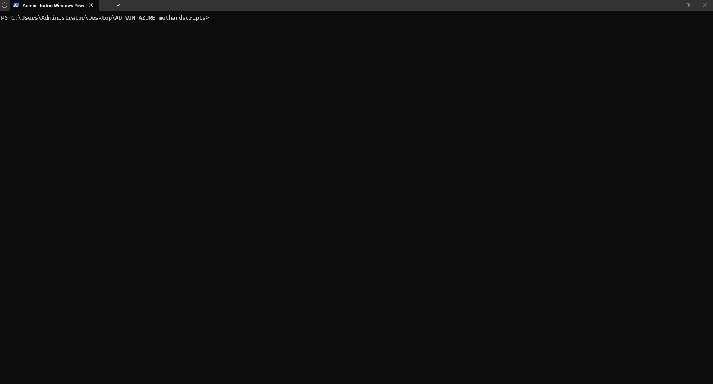
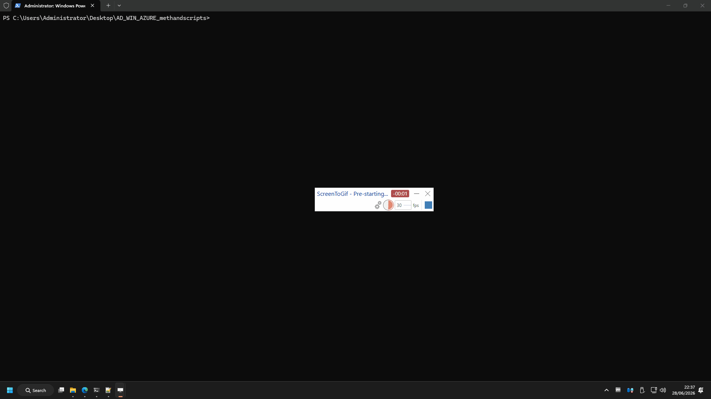

# Active Directory review

Pentester-focused **AD-only** automation aligned to `Draft_AD_Methodology_FINAL.xlsx` (~129 workbook rows; ~110 in-scope; ~50 automated script checks). For DC OS hardening use [WINBUILD_README.md](WINBUILD_README.md). For Azure/Entra cloud use [AZURE_README.md](AZURE_README.md). Pack overview: [README.md](README.md).

| Item | Value |
|------|--------|
| Script | `ADReviewv1.ps1` (**v1.0.5**) |
| Shared | `ADReview.Common.ps1` |
| Installer | `Install-ADReviewTools.ps1` |
| Workbook | `Draft_AD_Methodology_FINAL.xlsx` |

**Scope:** AD objects, domain/forest policy, trusts, delegation, ADCS posture (mostly MANUAL), optional hybrid Entra signals. **Not** Windows Server CIS baselines, SMB, patching, or Azure resources.

**Platform:** **Windows only** (RSAT `ActiveDirectory` module). Targets an **AD DS domain** wherever DCs run — on-prem **or** on Azure VMs — via domain-joined host or `-Domain` / `-Server` from a jump with LDAP reachability.

---

## Requirements

- PowerShell **5.1+** (no Python for the review script)
- RSAT **ActiveDirectory** module
- Domain read access; domain-joined host or `-Domain` / `-Server`
- Optional: SharpHound, PingCastle, Purple Knight in PATH or `.\tools`

---

## Quick start

```powershell
cd C:\path\to\AD_WIN_AZURE_methandscripts
.\Install-ADReviewTools.ps1 -InstallAll -AddToolsToUserPath
.\ADReviewv1.ps1
.\ADReviewv1.ps1 -Domain "corp.example.com" -Server "DC01"
.\ADReviewv1.ps1 -RunSharpHound -RunPingCastle
```

### Demo

Tool installer check:



Review script run (CSV/HTML output):



---

## Parameters (`ADReviewv1.ps1`)

| Parameter | Description |
|-----------|-------------|
| `-Domain` | DNS domain (default: current logon domain) |
| `-Server` | DC to bind (default: PDC emulator) |
| `-OutputPath` | Report directory (default: script folder) |
| `-RunSharpHound` | Run SharpHound if found in PATH or `.\tools` |
| `-RunPingCastle` | Run PingCastle healthcheck if available |
| `-PingCastleServer` | DC FQDN for PingCastle `--server` (default: PDC). OSS PingCastle has **no** `--timeout`; offline DCs in AD still slow the scan |
| `-RunPurpleKnight` | Run `Invoke-PKAssessment` if Purple Knight installed |
| `-SkipExternalTools` | Skip SharpHound / PingCastle / Purple Knight rows |
| `-IncludeEntra` | Hybrid Entra checks via Microsoft Graph |
| `-EntraTenantId` | Entra tenant (e.g. `contoso.onmicrosoft.com`) for `Connect-MgGraph`; use with MSA/guest accounts |

Some checks (LDAP signing, Kerberos encryption types) auto-run only **on a DC**; otherwise they appear as `MANUAL`.

---

## Hybrid Entra (`-IncludeEntra`)

Optional; only for hybrid/cloud identity checks, not on-prem-only domains. Install Graph with `-InstallGraphModule`, then sign in **to your Entra tenant**. Microsoft accounts (e.g. `@live.com`) and guest (`#EXT#`) identities usually need **`Connect-MgGraph -TenantId`** (Graph cmdlet — not the same as script **`-EntraTenantId`**):

```powershell
.\Install-ADReviewTools.ps1 -InstallGraphModule
Connect-MgGraph -TenantId contoso.onmicrosoft.com `
  -Scopes Policy.Read.All,User.Read.All,RoleManagement.Read.Directory -UseDeviceCode
Get-MgContext
.\ADReviewv1.ps1 -IncludeEntra -EntraTenantId contoso.onmicrosoft.com
```

On Windows Server or embedded terminals, prefer **`-UseDeviceCode`**. Without `Microsoft.Graph`, Entra rows report **MANUAL** (not ERROR). `Connect-MgGraph` is interactive and is not run by the installer.

---

## External tools

| Tool | Role | Auto-run flag |
|------|------|---------------|
| SharpHound | AD collection for BloodHound | `-RunSharpHound` |
| PingCastle | AD healthcheck | `-RunPingCastle` |
| Purple Knight | Semperis assessment | `-RunPurpleKnight` |
| BloodHound CE | GUI analysis | Manual (Docker + bloodhound-cli) |

Without `-Run*` flags, the script **detects** tools and emits **MANUAL** guidance. See [README.md](README.md#bloodhound-ce-ad-and-azure-collectors) for BloodHound CE.

---

## Outputs

| File | Content |
|------|---------|
| `ADReview-<timestamp>.txt` | Full log |
| `ADReview-<timestamp>.csv` | Structured results |
| `ADReview-<timestamp>.html` | Summary table |
| `<sharphound-timestamp>_sharphound-<domain>.zip` | If `-RunSharpHound` (SharpHound prepends collection time) |
| `pingcastle-<timestamp>/` | If `-RunPingCastle` |

---

## Methodology sections (v3)

1. Automation / Scanning  
2. Account Settings  
3. Group Settings  
4. Domain Settings  
5. Service Settings  
6. Hybrid Entra ID  
7. Privilege Delegation  
8. Certificate Settings (ADCS - mostly MANUAL in v1)  
9. Maintenance  

**v1 limitations:** Many rows stay `REVIEW` or `MANUAL` (ADCS, GPO ACLs, full Entra hybrid). Use PingCastle / Purple Knight and the workbook **Commands/Guidance** column for full methodology coverage. Triage automated output against the workbook by **Title → column F** (see [README.md — Workbook vs runner](README.md#workbook-vs-runner-all-tracks)).

The workbook uses the shared **13-column** methodology header row (same as Azure/WinBuild): Type, Scope, Executor, Executed, Comments, Title, Description, Tooling, Commands/Guidance, Mitre Technique, Policy, Written Issues, Notes.

**Workbook vs runner:** the `.xlsx` lists every control; `ADReviewv1.ps1` automates a subset and flags others as `MANUAL` / `REVIEW`. Triage CSV output by matching **Title** to workbook **column F** (titles often differ — e.g. script `Duplicate SPNs` → workbook `Check for Duplicated SPNS`). See [README.md — Workbook vs runner](README.md#workbook-vs-runner-all-tracks).

---

## Tool installer (`Install-ADReviewTools.ps1`)

```powershell
.\Install-ADReviewTools.ps1                    # check only
.\Install-ADReviewTools.ps1 -InstallAll -AddToolsToUserPath
.\Install-ADReviewTools.ps1 -InstallGraphModule   # hybrid Entra (-IncludeEntra)
.\Install-ADReviewTools.ps1 -InstallGraphModule -Upgrade
```

| Switch | Action |
|--------|--------|
| `-InstallSharpHound` | Download SharpHound.exe to `.\tools` |
| `-InstallPingCastle` | Download PingCastle.exe to `.\tools` |
| `-InstallGraphModule` | `Install-Module Microsoft.Graph` (CurrentUser); add `-Upgrade` to update when PSGallery has a newer version (skips if already at latest; close other PowerShell sessions if modules are in use) |
| `-InstallAll` | SharpHound + PingCastle (add `-InstallGraphModule` for hybrid Entra) |
| `-Upgrade` | SharpHound/PingCastle when missing, tag unknown, or newer GitHub release; with `-InstallGraphModule`, update Graph from PSGallery when newer (skips if at latest) |
| `-AddToolsToUserPath` | Append `.\tools` to user PATH |

Purple Knight: install manually from [Semperis](https://www.semperis.com/purple-knight/).

**Uninstall / reinstall binaries (e.g. for documentation capture):**

```powershell
$toolsDir = Join-Path (Get-Location) "tools"
Remove-Item "$toolsDir\SharpHound.exe", "$toolsDir\PingCastle.exe" -Force -ErrorAction SilentlyContinue

$userPath = [Environment]::GetEnvironmentVariable("Path", "User")
$parts = $userPath -split ';' | Where-Object { $_ -and $_.Trim() -ne "" -and ($_.Trim() -ne $toolsDir) }
[Environment]::SetEnvironmentVariable("Path", ($parts -join ';'), "User")

.\Install-ADReviewTools.ps1 -InstallAll -AddToolsToUserPath
```

---

## Check statuses

Same definitions as the pack overview: [README.md — Check result statuses](README.md#check-result-statuses-all-scripts).

---

## Appendix: automation coverage by section

| Methodology section | `ADReviewv1.ps1` v1 coverage |
|---------------------|------------------------------|
| **Automation / Scanning** | Detect SharpHound, PingCastle, Purple Knight; run with `-Run*`; install via `Install-ADReviewTools.ps1` |
| **Account Settings** | Password flags, pre-auth, SPNs, guest, lockout, domain password policy, DCSync ACLs, PGID, machine quota |
| **Group Settings** | Domain Admins count, Protected Users, operators, Pre-Win2000, computers in privileged groups |
| **Domain Settings** | dsHeuristics, SID history, trusts, recycle bin, functional level; **GPO ACLs = MANUAL** |
| **Service Settings** | DnsAdmins, gMSA, LAPS-in-AD, LDAP/Kerberos on DC, AAD Connect sync account |
| **Hybrid Entra ID** | Skipped unless **`-IncludeEntra`** |
| **Privilege Delegation** | Unconstrained / constrained / RBCD delegation; **broad ACL delegations = MANUAL** |
| **Certificate Settings (ADCS)** | **MANUAL** (certutil on CA, PingCastle / Purple Knight ADCS rules) |
| **Maintenance** | Tombstone lifetime, DC count, inactive users, Schema Admins, krbtgt age; **backup = MANUAL** |
