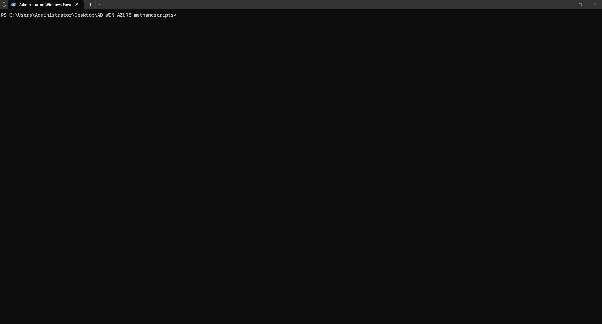

# Azure cloud review

Pentester-focused **Entra ID + Azure resource** automation aligned to `Draft_Methodology_Azure_FINAL.xlsx` (~89 checks, 35 sections). For on-prem AD use [AD_README.md](AD_README.md). For Windows OS hardening use [WINBUILD_README.md](WINBUILD_README.md). Pack overview: [README.md](README.md).

| Item | Value |
|------|--------|
| Script | `AzureCloudReviewv1.ps1` (**v1.0.0**) |
| Shared | `AzureCloudReview.Common.ps1` |
| Installer | `Install-AzureReviewTools.ps1` |
| Lab | `Deploy-AzureReviewLab.ps1`, `Destroy-AzureReviewLab.ps1` (**v1.0.2** destroy) |
| AzureHound auth | `Get-AzureHoundRefreshToken.ps1` → `tools\azurehound.refresh` |
| Workbook | `Draft_Methodology_Azure_FINAL.xlsx` |

**Scope:** Entra ID, Azure resources, RBAC, CIS-aligned misconfigs, identity attack-path hints. Read-only via **Azure CLI** and Graph REST. Does **not** require Python for the core review script.

Methodology workbook: shared **13-column** header row (see [README.md](README.md#repository-layout)); generic **`Policy`** column is intentionally empty.

---

## Requirements

- PowerShell **5.1+** or **7 (`pwsh`)** on Linux
- **Azure CLI** (`az login`); Reader+ on in-scope subscriptions
- Optional Python **3.10–3.12** for Prowler; **3.10+** for ROADrecon

| Role | Enough for review? |
|------|-------------------|
| **Reader** on subscription | Yes for most `az` reads |
| **Global Reader** (Entra) | Better for Graph policy checks |
| **Contributor** | Required for `Deploy-AzureReviewLab.ps1` only |

---

## Quick start

```powershell
cd C:\path\to\AD_WIN_AZURE_methandscripts
.\Install-AzureReviewTools.ps1 -InstallAll -AddToolsToUserPath
az login
.\AzureCloudReviewv1.ps1
.\AzureCloudReviewv1.ps1 -SubscriptionId "<guid>" -RunProwler
```

**Minimum (no Python):**

```powershell
winget install Microsoft.AzureCLI
az login
.\AzureCloudReviewv1.ps1
```

Service-specific sections **SKIP** when that resource type is not deployed.

### Demo

Tool installer check (`Install-AzureReviewTools.ps1`):



Cloud review run (`AzureCloudReviewv1.ps1`; example uses `-RunProwler`):


---

## Parameters (`AzureCloudReviewv1.ps1`)

| Parameter | Description |
|-----------|-------------|
| `-SubscriptionId` | One or more GUIDs (default: all enabled subs) |
| `-OutputPath` | Report directory |
| `-RunProwler` | Run Prowler CIS 5.0 L1 if `prowler` in PATH |
| `-SkipIdentityTools` | Skip ROADrecon / AzureHound hint rows |

---

## Outputs

| File | Content |
|------|---------|
| `AzureCloudReview-<timestamp>.txt` | Full log |
| `AzureCloudReview-<timestamp>.csv` | Structured results |
| `AzureCloudReview-<timestamp>.html` | Summary table |
| `prowler-<sub>-<timestamp>/` | If `-RunProwler` (CSV, HTML, compliance CSV) |

**Prowler notes:** Scan completes with **INFO** in the review script even when findings FAIL (Prowler exit code 3 is normal). Use Python **3.10–3.12**, not 3.14.

Standalone Prowler:

```bash
prowler azure --az-cli-auth --subscription-ids <id> --compliance cis_5.0_azure \
  -M csv html -o ./prowler-output --ignore-exit-code-3
```

---

## Tool installer (`Install-AzureReviewTools.ps1`)

```powershell
.\Install-AzureReviewTools.ps1                    # check only
.\Install-AzureReviewTools.ps1 -InstallAll -AddToolsToUserPath
```

| Switch | Action |
|--------|--------|
| `-InstallAzCli` | Azure CLI via winget |
| `-InstallPythonTools` | `pip install prowler roadrecon` (skips if already installed unless `-Upgrade`) |
| `-InstallAzureHound` | Download `azurehound.exe` to `.\tools` |
| `-InstallAll` | All three |
| `-AddToolsToUserPath` | Append `.\tools` + Python Scripts to user PATH |

Shared download folder: **`.\tools`** (AzureHound, `azurehound.refresh`, `azurehound.json`).

AzureHound auth helper: **`Get-AzureHoundRefreshToken.ps1`** (device code → `tools\azurehound.refresh`). Collection is a **separate** `azurehound list` step — see [AzureHound (attack paths)](#azurehound-attack-paths).

---

## Identity tools (manual — methodology section 35)

These steps are **manual** after `AzureCloudReviewv1.ps1`. They do not replace the script; they deepen **Entra ID** and **attack-path** analysis. Use **`-SkipIdentityTools`** to omit ROADrecon / AzureHound hint rows in section 35.

### Split of responsibilities

| Tool | Best for |
|------|----------|
| `AzureCloudReviewv1.ps1` | Subscription RBAC, resource misconfigs, some Entra signals via `az` / Graph REST |
| **ROADrecon** | Entra object inventory: users, roles, apps, service principals, CA policies |
| **AzureHound + BloodHound CE** | Privilege-escalation **paths** (who can reach Owner / GA / UAA) |

BloodHound CE setup: [README.md](README.md#bloodhound-ce-ad-and-azure-collectors).

---

### ROADrecon

ROADrecon **enumerates** Entra ID into a local SQLite DB (`roadrecon.db`). It does not emit PASS/FAIL like Prowler; you review in the **GUI** or **plugins**.

#### 1. Target tenant

Use the same tenant as `az login`:

```powershell
az account show --query "{tenantId:tenantId, tenantDomain:tenantDefaultDomain}" -o table
```

Sign in with an identity that has **read access in that tenant** (Global Reader, Security Reader, or Global Administrator). A personal Microsoft account with no role in the lab tenant will not produce useful data.

#### 2. Authenticate (device code)

**Do not** use plain `roadrecon auth --device-code` alone on current tenants — it often lands on the **Microsoft Services** tenant (`f8cdef31-…`) or uses a client blocked for legacy **AAD Graph** (`graph.windows.net` → HTTP 403).

Remove any stale token file first:

```powershell
Remove-Item .roadtools_auth -Force -ErrorAction SilentlyContinue
```

Auth with **tenant** (`-t`, not `-d`) and the **Azure CLI** public client ID (Microsoft first-party app; workaround for AAD Graph blocks — see [ROADtools issue #147](https://github.com/dirkjanm/ROADtools/issues/147)):

```powershell
roadrecon auth --device-code -c 04b07795-8ddb-461a-bbee-02f9e1bf7b46 -t contoso.onmicrosoft.com
```

Replace `contoso.onmicrosoft.com` with your tenant domain or GUID from `az account show`.

| Flag | Meaning |
|------|---------|
| `-t` / `--tenant` | Entra tenant to authenticate **into** |
| `-c` / `--client` | OAuth public client ID (`04b07795-…` = **Azure CLI**) |

Default ROADrecon client (`1b730954-…`, Azure AD PowerShell) is often blocked for directory enumeration.

#### 3. Gather and explore

```powershell
roadrecon gather
roadrecon gui
```

**Success:** no `Error 403` lines; hundreds of HTTP requests (not ~19); GUI shows users, apps, roles, etc.

If gather still hits AAD Graph 403s, upgrade ROADtools and try Microsoft Graph mode (newer builds):

```powershell
python -m pip install --upgrade roadrecon roadtx
roadrecon gather --msgraph
roadrecon gui --msgraph
```

#### 4. Built-in analysis commands

```powershell
roadrecon plugin -h
```

| Command | Purpose |
|---------|---------|
| `roadrecon gui` | Browse directory objects, role assignments, app permissions |
| `roadrecon plugin policies -f caps.html -p` | Export **Conditional Access** policies to HTML (+ console summary) |
| `roadrecon plugin bloodhound -h` | Export Entra data for BloodHound (custom ingest) |
| `roadrecon dump -h` | Dump DB to files (options vary by version) |

Optional extra collectors (if your `roadrecon -h` lists them): `pimgather`, `azgather`, etc. — only needed for PIM or Azure RBAC detail beyond core `gather`.

#### 5. What to look for (section 35)

| Area | Examples |
|------|----------|
| **Privileged roles** | Global Administrator, Privileged Role Administrator, permanent vs eligible assignments |
| **Service principals / apps** | High Graph permissions, **client secrets/certs**, dangerous API permissions, app **owners** |
| **Consent & delegation** | OAuth2 permission grants, over-broad delegated admin consent |
| **Guests** | `#EXT#` users in privileged roles |
| **Conditional Access** | Gaps for admins, legacy auth, incomplete coverage — use `plugin policies` |
| **Tenant policy** | Guest invite settings, default user role permissions, authorization policy |

ROADrecon does **not** replace subscription CIS checks (storage, KV, NSG, etc.) — those stay in `AzureCloudReviewv1.ps1` and Prowler.

---

### AzureHound (attack paths)

**AzureHound v2+** (e.g. **v2.12.2**): `start` is for **BloodHound Enterprise** only. For **BloodHound CE**, use **`list`** and write **JSON** (ingest in the CE UI — not `.zip`).

**Do not** pass a Graph-only JWT from `az account get-access-token --resource https://graph.microsoft.com` — AzureHound also calls **Azure Resource Manager** (`management.azure.com`). A Graph token causes `invalid audience` on subscription/tenant steps (Entra + ARM collection still partially completes).

#### Recommended: two-step workflow (auth, then collect)

**Do not reuse ROADrecon’s `.roadtools_auth` refresh token.** ROADrecon auth uses the **Azure CLI** client (`04b07795-8ddb-461a-bbee-02f9e1bf7b46`). AzureHound exchanges refresh tokens as the **Azure PowerShell** public client (`1950a258-227b-4e31-a9cf-717495945fc2`). Passing the ROADrecon token (even with `-a 04b07795-…`) usually returns **`AADSTS70000: Provided grant is invalid or malformed`**.

**AzureHound does not accept `-r file`** (that magic string is ROADtools-only).

Keep **token acquisition** and **AzureHound collection** as separate steps (same pattern as ROADrecon: `auth` then `gather`).

**Step 1 — acquire refresh token** (`Get-AzureHoundRefreshToken.ps1` writes `.\tools\azurehound.refresh`):

```powershell
cd C:\path\to\AD_WIN_AZURE_methandscripts
.\Get-AzureHoundRefreshToken.ps1
```

Sign in at https://microsoft.com/devicelogin when prompted.

**Step 2 — run AzureHound**:

```powershell
$tenant = (az account show --query tenantDefaultDomain -o tsv)
$rt = Get-Content .\tools\azurehound.refresh -Raw
azurehound list -r $rt -t $tenant -o .\tools\azurehound.json
```

Optional — limit to one subscription:

```powershell
$sub = (az account show --query id -o tsv)
azurehound list -r $rt -t $tenant -b $sub -o .\tools\azurehound.json
```

Ingest **`azurehound.json`** in **BloodHound CE** — Docker must use **Linux containers** ([README.md](README.md#bloodhound-ce-ad-and-azure-collectors)). Pathfinding steps below.

#### BloodHound CE — Azure pathfinding

After ingest, use the graph to find **privilege-escalation chains** (who can reach Global Administrator, subscription Owner, User Access Administrator, etc.). ROADrecon covers Entra inventory and policies; BloodHound maps **permission edges** between identities and high-value targets.

1. Open **http://localhost:8080/ui/login** → **Administration** → **File Ingest** → upload `tools\azurehound.json`.
2. Confirm Azure node counts (service principals, roles, subscriptions) are non-zero.

**Prebuilt queries (fastest)**

1. **Explore** → **Cypher** search bar → **folder icon** (prebuilt searches).
2. Filter **Platform → Azure**.
3. Run useful starting queries:

| Prebuilt query (typical name) | Purpose |
|-------------------------------|---------|
| All Global Administrators | Who holds GA |
| All Privileged Role Administrators | PRA holders |
| Shortest paths to high value roles | Escalation chains to GA / UAA / app admin roles |
| Service principals with high privileges | Abusable SP starting points |

Results render as a graph: **nodes** = users, groups, service principals, roles, subscriptions, key vaults, etc.; **edges** = abuse relationships (`AZOwner`, `AZUserAccessAdministrator`, role membership, …). Click an edge to read what each hop means.

**Pathfinding from a known starting point**

1. **Search** for your compromised principal (user, group, or `AZServicePrincipal`).
2. Select the node → **Set as Starting Node** (or right-click pathfinding options).
3. Search for a target (e.g. **Global Administrator** role, or your subscription).
4. **Set as Ending Node** → run **Pathfinding**.

Optional: right-click a node → **Mark as Owned**, then use owned-principal path queries where available.

**Custom Cypher examples**

Shortest path to Global Administrator:

```cypher
MATCH (n:AZRole {displayname: 'Global Administrator'}), (m),
      p = shortestPath((m)-[r*1..]->(n))
WHERE NOT m = n
RETURN p
```

Paths toward subscription control (adjust subscription name/id from Search):

```cypher
MATCH (sub:AZSubscription), (m),
      p = shortestPath((m)-[r*1..]->(sub))
WHERE NOT m = sub
RETURN p
LIMIT 25
```

From a named service principal:

```cypher
MATCH (sp:AZServicePrincipal {displayname: 'YourAppName'}),
      (target:AZRole {displayname: 'Global Administrator'}),
      p = shortestPath((sp)-[r*1..]->(target))
RETURN p
```

**Reading escalation edges**

| Edge (examples) | Meaning |
|-----------------|--------|
| `AZGlobalAdmin` / role membership | Entra privileged role |
| `AZOwner` | Full control of subscription or resource |
| `AZUserAccessAdministrator` | Can grant RBAC → path to Owner |
| `AZAddSecret` / app role assignments | Control of an app/SP with further rights |
| Key vault / managed identity edges | Resource → identity abuse chains |

Walk each path start → end; every arrow is one step an attacker would execute.

**Lab tenant note (free / no Entra P1/P2)**

AzureHound may skip **user** detail (`Authentication_RequestFromNonPremiumTenantOrB2CTenant`). You still get service principals, roles, RBAC, key vaults, and web apps — enough for lab path analysis. Cross-check identities and CA policy in **ROADrecon**; use BloodHound for **Owner / UAA / GA chains** via SPs and role assignments.

**Suggested pathfinding order (section 35)**

1. Prebuilt → **All Global Administrators**
2. Prebuilt → **Shortest paths to high value roles**
3. Pathfind from your assessment account → **Global Administrator**
4. Pathfind to **subscription Owner** on the lab subscription
5. Expand high-value nodes (key vaults, web apps, privileged SPs)

More: [BloodHound Cypher search](https://bloodhound.specterops.io/analyze-data/explore/cypher-search) · [AzureHound CE collection](https://bloodhound.specterops.io/collect-data/ce-collection/azurehound)

#### Expected errors on free / lab tenants (often OK)

| Log line | Meaning |
|----------|---------|
| `invalid audience` (with `--jwt`) | Graph JWT used where ARM token needed — use refresh token auth instead |
| `AADSTS9002313` / `invalid_grant` with `-r file` | AzureHound does not support `-r file`; use `Get-AzureHoundRefreshToken.ps1` instead |
| `AADSTS70000` / `invalid_grant` with ROADrecon `$rt` | Wrong client — ROADrecon token is Azure CLI; AzureHound needs Azure PowerShell device-code token |
| `Authentication_RequestFromNonPremiumTenantOrB2CTenant` | User detail APIs need Entra ID P1/P2 — users may be missing; other objects still collect |
| `PermissionScopeNotGranted` (RoleManagement / PIM) | No PIM read scopes — normal without Global Reader + PIM licensing |
| `Resource 'a0b1b346-…' does not exist` | Benign on small tenants (default User role template) |

`collection completed` with hundreds of service principals / role assignments is usually **enough for lab path analysis**.

**Service principal count (~100–200 on a small tenant) is normal.** AzureHound lists every **enterprise application** service principal in Entra, mostly **Microsoft first-party** identities (Portal, Graph, ARM, Office, etc.) created when the tenant and subscription are used — not by `Deploy-AzureReviewLab.ps1` (that script does not modify Entra). Custom **app registrations** are usually far fewer (often 1–5); managed identities from lab resources add only a handful. For section 35, focus on **privileged or path-relevant** SPs in BloodHound/ROADrecon, not the total count.

```powershell
azurehound list --help
```

See [AzureHound CE docs](https://bloodhound.specterops.io/collect-data/ce-collection/azurehound).

---

### Suggested section 35 workflow

1. Run `AzureCloudReviewv1.ps1` (and `-RunProwler` if in scope).
2. ROADrecon: auth → gather → `plugin policies` → GUI review.
3. AzureHound → BloodHound CE pathfinding (prebuilt Azure queries + pathfinding; see **BloodHound CE — Azure pathfinding** above).
4. Triage **MANUAL** / **REVIEW** rows in section 35 of `Draft_Methodology_Azure_FINAL.xlsx` against the above.

---

## Tier 2 lab (optional)

Intentionally weak resources for testing FAIL/REVIEW rows in `AzureCloudReviewv1.ps1`.

**First deploy:** Resource providers (`Microsoft.KeyVault`, `Microsoft.Sql`, etc.) register automatically (1–3 minutes each).

**Re-run / add flags:** Safe to re-run on existing `rg-cloudreview-lab` (e.g. add `-IncludeExtendedLab`). Existing resources log `[i] … already exists` and lab misconfigurations are re-applied.

**SQL:** Some subscriptions block new SQL in `eastus` — script tries fallback regions or `-SqlLocation westus2`. Use `-SkipSql` to omit SQL.

**Compute quota:** App Service (F1) and `-IncludeVm` need regional quota. Script tries `-Location` then fallbacks (`eastus`, `westus2`, …). Pin with `-ComputeLocation eastus`.

**Extended lab (`-IncludeExtendedLab`):** ACR Basic, Service Bus Basic, Cognitive **F0** (tries several kinds if quota blocks paid SKUs), Cosmos serverless — public access by design. Modest extra cost while running.

**Regions:** CLI uses lowercase slugs. **UK South** = `uksouth`. App Service / VM may land in a different region than storage (e.g. westus2) when quota requires it.

```powershell
.\Deploy-AzureReviewLab.ps1 -Location uksouth -SqlLocation uksouth -IncludeVm -IncludeExtendedLab
.\AzureCloudReviewv1.ps1 -SubscriptionId "<guid-from-manifest>" -RunProwler
.\Destroy-AzureReviewLab.ps1 -Force
```

### Deploy parameters

| Parameter | Description |
|-----------|-------------|
| `-ResourceGroupName` | Default: `rg-cloudreview-lab` |
| `-Location` | Region for storage, network, KV, extended lab. Default: `eastus` |
| `-SqlLocation` | SQL only; auto-fallback if blocked |
| `-ComputeLocation` | App Service + VM; auto-fallback on zero quota |
| `-SkipSql` | Skip SQL server |
| `-SkipAppService` | Skip App Service |
| `-SubscriptionId` | Target subscription |
| `-Prefix` | Resource name prefix (default: `crlab`) |
| `-IncludeVm` | Linux VM (B1s) with public IP |
| `-IncludeExtendedLab` | ACR, Service Bus, Cognitive, Cosmos (sections 4, 6, 15, 30) |

### Destroy parameters

| Parameter | Description |
|-----------|-------------|
| `-Force` | Skip confirmation |
| `-KeepManifest` | Keep `AzureReviewLab-manifest.json` |
| `-WaitTimeoutMinutes` | RG delete wait (default: 20) |

Destroy deletes the **entire resource group** (core + extended lab), purges soft-deleted Key Vaults and Cognitive Services accounts, and sweeps resources tagged `Purpose=CloudReviewLab`. Does **not** remove `NetworkWatcherRG` unless lab-tagged.

| Tier | Setup | What you exercise |
|------|-------|-------------------|
| 1 | Free account, no deploy | Entra, governance; many service sections SKIP |
| 2 | `Deploy-AzureReviewLab.ps1` | Storage, NSG, KV, SQL, App Service; `-IncludeVm`; `-IncludeExtendedLab` |
| 3 | Full engagement | AKS, Cosmos, etc.; Prowler as CIS baseline |

**Linux / Kali:** Run review with `pwsh` + `az`. `Install-AzureReviewTools.ps1` is Windows-only; install Prowler/ROADrecon via pip and AzureHound from [GitHub releases](https://github.com/SpecterOps/AzureHound/releases) manually.

---

## v1 limitations

Many checks are heuristic `REVIEW`; legacy `az ad` MFA signals may be incomplete; Front Door / ML / Synapse rows are inventory-heavy. Use Prowler CIS L1 as the authoritative CSPM baseline when in scope.

---

## Check statuses

Same definitions as the pack overview: [README.md — Check result statuses](README.md#check-result-statuses-all-scripts). Azure-specific: **`SKIP`** = resource type not deployed; **`INFO`** includes a successful Prowler run.

---

## Appendix A: methodology v7 — all 35 sections

Source: `Draft_Methodology_Azure_FINAL.xlsx`.

| # | Section |
|---|---------|
| 1 | Automation / Scanning / Tool Setup |
| 2 | Azure Entra ID |
| 3 | Azure Storage Accounts |
| 4 | AI Services |
| 5 | Azure Functions |
| 6 | Azure Cosmos DB |
| 7 | Network |
| 8 | AKS |
| 9 | API Management |
| 10 | Access Control |
| 11 | Activity Log |
| 12 | Advisor |
| 13 | App Service |
| 14 | Container Apps |
| 15 | Container Registry |
| 16 | Databricks |
| 17 | Front Door |
| 18 | Key Vault |
| 19 | Locks |
| 20 | Machine Learning |
| 21 | Monitor |
| 22 | MySQL |
| 23 | Policy |
| 24 | PostgreSQL |
| 25 | Recovery Services |
| 26 | Redis Cache |
| 27 | Resources |
| 28 | Search |
| 29 | Defender |
| 30 | Service Bus |
| 31 | SQL |
| 32 | Subscriptions |
| 33 | Synapse |
| 34 | Virtual Machines |
| 35 | Identity & Attack Path |

---

## Appendix B: script automation coverage by section

| # | Section | `AzureCloudReviewv1.ps1` coverage |
|---|---------|-----------------------------------|
| 1 | Automation | Optional **Prowler CIS 5.0 L1** with `-RunProwler` |
| 2 | Entra ID | Guests, security defaults, MFA, app registration, consent via Graph / `az rest` |
| 3 | Storage | HTTPS, public blob, network restrictions, Entra default auth |
| 4 | AI Services | Cognitive public network access |
| 5 | Functions | Remote debugging, HTTPS, managed identity |
| 6 | Cosmos DB | Public network access |
| 7 | Network | Permissive NSG, Network Watcher, NIC IP forwarding |
| 8 | AKS | Private cluster, Entra RBAC, public FQDN |
| 9 | API Management | Public network access |
| 10 | Access Control | Custom Owner-like roles |
| 11 | Activity Log | Activity alerts, service health alerts |
| 12 | Advisor | Security recommendation count |
| 13 | App Service | Remote debugging, auth, Key Vault refs |
| 14 | Container Apps | Public access, managed identity |
| 15 | Container Registry | Public access, private endpoints |
| 16 | Databricks | VNet injection (**REVIEW**) |
| 17 | Front Door | Profile inventory (**REVIEW**) |
| 18 | Key Vault | Soft delete, purge protection, RBAC, network ACLs |
| 19 | Locks | Subscription resource locks |
| 20 | Machine Learning | CMK signal (**REVIEW**) |
| 21 | Monitor | Diagnostic / activity log export |
| 22 | MySQL | In-transit encryption |
| 23 | Policy | Policy assignments |
| 24 | PostgreSQL | Entra admin, TLS / firewall |
| 25 | Recovery Services | Backup alerts |
| 26 | Redis Cache | In-transit encryption |
| 27 | Resources | Tagging |
| 28 | Search | Public access, managed identity |
| 29 | Defender | Assessments, alerts, external write roles |
| 30 | Service Bus | Public network access |
| 31 | SQL | TLS, Entra admin, firewall, auditing |
| 32 | Subscriptions | Owner count, UAA, budgets, policies |
| 33 | Synapse | TDE (**REVIEW**) |
| 34 | Virtual Machines | Public IPs, VMSS, JIT |
| 35 | Identity & Attack Path | Script: RBAC / SP counts via `az`. **Manual:** ROADrecon (Entra inventory + CA export), AzureHound → BloodHound (attack paths) |
