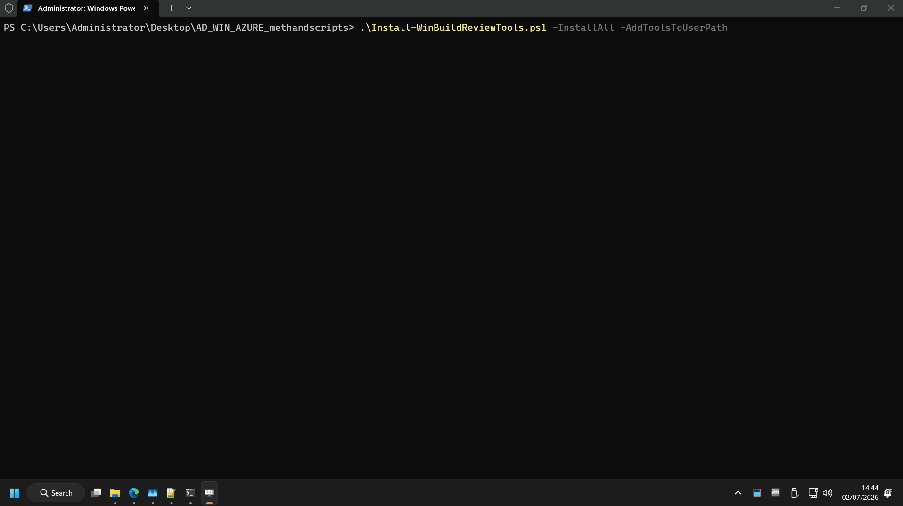
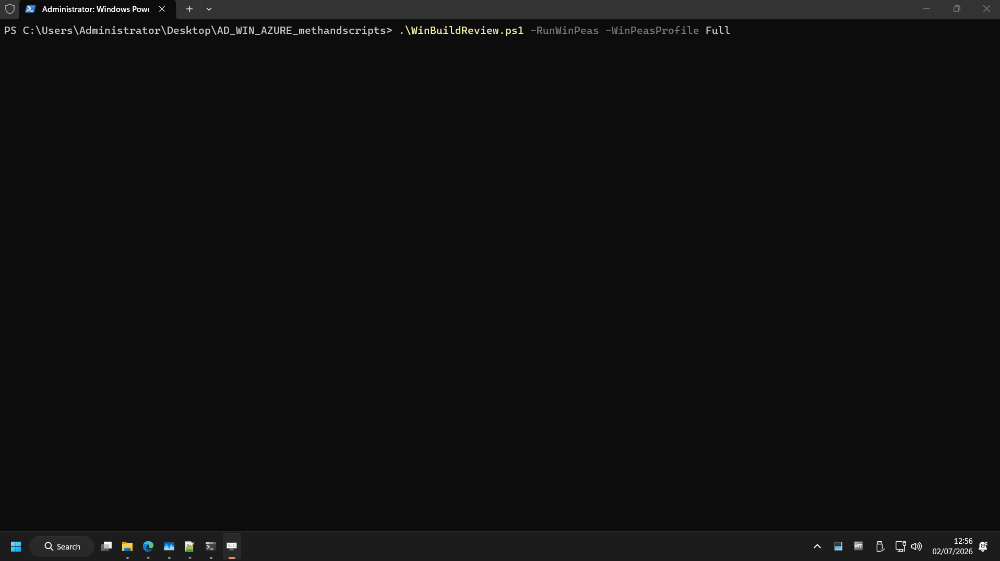
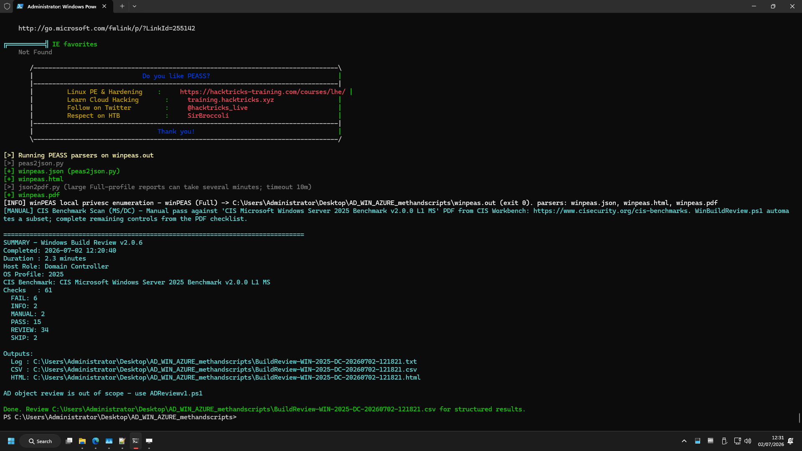

# Windows build review

Pentester-focused **local OS hardening** automation aligned to `Draft_Windows-Build-Review-Methodology_FINAL.xlsx` (~62 workbook rows; ~61 script checks; CIS-oriented). For AD object review use [AD_README.md](AD_README.md). For Azure cloud use [AZURE_README.md](AZURE_README.md). Pack overview: [README.md](README.md).

| Item | Value |
|------|--------|
| Script | `WinBuildReview.ps1` (**v2.1.0**) |
| Shared | `WinBuildReview.Common.ps1`, `WinBuildReview.CisProfiles.ps1`, `WinBuildReview.PrivEscDeep.ps1` |
| Installer | `Install-WinBuildReviewTools.ps1` (**v1.1.0**, optional winPEAS) |
| Workbook | `Draft_Windows-Build-Review-Methodology_FINAL.xlsx` |

**Scope:** OS services, patching signals, SMB, firewall, Defender, local GPO on **member servers and DCs** (on-prem or **Azure VMs**). **No** AD object checks, **no** Azure subscription checks. Optional **winPEAS** for deep local privesc enumeration (`-RunWinPeas`).

**Platform:** **Windows only** — **elevated** PowerShell on each in-scope host for CIS/build review; non-elevated **only** with `-RunWinPeas` (WinPeasOnly).

Workbook columns match the pack-wide **13-column** schema (see [README.md](README.md#repository-layout)); CIS benchmark versions per OS are preserved in **Notes** (`[CIS Refs]: …`).

**Workbook vs runner:** ~62 workbook rows vs ~61 script checks (closest alignment of the three tracks). The runner **automates data collection** and writes evidence to **TXT / CSV / HTML**; you triage by **Title → column F** and apply analyst judgement on `REVIEW` / `MANUAL` rows. See [README.md — Workbook vs runner](README.md#workbook-vs-runner-all-tracks).

---

## Requirements

- PowerShell **5.1+**
- **Elevated** PowerShell for CIS/build review (`Run as administrator`); non-elevated only with `-RunWinPeas`
- **Supported OS profiles:** 2012, 2012R2, 2016, 2019, 2022, 2025 (CIS-mapped)
- **Not supported:** Server 2008 / 2008 R2 as review targets

| Profile | CIS benchmark (L1 MS unless noted) |
|---------|-------------------------------------|
| 2012 | Windows Server 2012 v3.0.0 |
| 2012R2 | Windows Server 2012 R2 v3.0.0 |
| 2016 | Windows Server 2016 v4.0.0 MS |
| 2019 | Windows Server 2019 v5.0.0 MS |
| 2022 | Windows Server 2022 v5.0.0 MS |
| 2025 | Windows Server 2025 v2.0.0 MS |

---

## Quick start

```powershell
cd C:\path\to\AD_WIN_AZURE_methandscripts
.\Install-WinBuildReviewTools.ps1 -InstallAll -AddToolsToUserPath   # optional winPEAS

# Pass 1 — elevated (Run as administrator)
.\WinBuildReview.ps1
.\WinBuildReview.ps1 -CisRenameReviewToFail   # promote ambiguous CIS REVIEW rows to FAIL

# Pass 2 — non-elevated (WinPeasOnly; CIS/build skipped)
.\WinBuildReview.ps1 -RunWinPeas

.\WinBuildReview.ps1 -OsProfile 2025
```

Run **on each in-scope server/DC** from an **elevated** PowerShell session (or non-elevated with `-RunWinPeas` only).







---

## Parameters

| Parameter | Description |
|-----------|-------------|
| `-OutputPath` | Report directory |
| `-OsProfile` | Override auto-detect (`2012`, `2012R2`, `2016`, `2019`, `2022`, `2025`) |
| `-CisRenameReviewToFail` | Promote ambiguous CIS baseline gaps from `REVIEW` to `FAIL` (LLMNR, LAPS, RunAsPPL, etc.). **Elevated session only**; each promotion is highlighted during the run. |
| `-RunWinPeas` | Run winPEAS when installed. **Non-elevated session:** only allowed switch — enters **WinPeasOnly** mode (CIS/hardening skipped; winPEAS only). **Elevated session:** winPEAS is skipped with a MANUAL reminder — complete CIS pass first, then re-run `-RunWinPeas` non-elevated. |
| `-WinPeasProfile` | `Focused` (default) or `Full` — both skip slow **eventsinfo** / file crawls |
| `-SkipExternalTools` | Skip winPEAS automation row only (full elevated review). **Cannot** combine with WinPeasOnly (`-RunWinPeas` non-elevated) — script exits. |

With `-RunWinPeas`, winPEAS runs with the **quiet** flag (findings + section output; suppresses banner/progress noise), streaming to the **console** and a timestamped **`.out`** file. If PEASS parsers are installed (`-InstallAll`), the script also runs **peas2json**, **json2html**, and **json2pdf** → matching `winpeas-<host>-<timestamp>.json`, `.html`, `.pdf` in `-OutputPath` (PDF has a 10-minute timeout on large reports). Prior runs are kept (no overwrite).

Default run includes CIS baseline, native deep privesc checks, and optional `-RunWinPeas` (two-pass — see [Running context](#running-context-admin-vs-standard-user-two-pass-workflow)).

---

## Deep local privesc (full run)

On a default full run, the script includes **native deep privesc checks** in **PRIVILEGE ESCALATION**:

| Check | What it looks for |
|-------|-------------------|
| AlwaysInstallElevated | MSI install elevation for low-priv users |
| Token impersonation privileges | Enabled `SeImpersonate`, `SeAssignPrimaryToken`, `SeDebug`, etc. |
| Writable service binaries | Running services whose `.exe` is writable by low-priv principals |
| Service DACL permissions | `sc sdshow` signals for Users/Authenticated Users/Everyone modify rights |
| Writable PATH entries | DLL hijack candidates in Machine/User `PATH` |
| (existing) | Unquoted paths, modifiable service registry keys, weak ACLs, hotfix/CVE correlation |

Optional **winPEAS** (`Install-WinBuildReviewTools.ps1 -InstallAll`, `-RunWinPeas`) adds broader enumeration. Default **Focused** profile skips event-log trawls (e.g. winlogon history) and file crawls; use `-WinPeasProfile Full` for network/browser/cloud modules.

### Running context: admin vs standard user (two-pass workflow)

The script uses **no extra switch** — behavior follows `-RunWinPeas` plus whether the PowerShell session is **elevated** (`Run as administrator`). **Non-elevated without `-RunWinPeas` is not supported** — the script exits with remediation text.

| Pass | How to launch | Command | What runs |
|------|---------------|---------|-----------|
| **1 — Build / CIS** | Elevated PowerShell | `.\WinBuildReview.ps1 -OutputPath C:\Reviews\Build-elevated` | Full CIS + hardening + native privesc checks; winPEAS row is MANUAL if tool installed |
| **2 — winPEAS** | Non-elevated PowerShell | `.\WinBuildReview.ps1 -RunWinPeas -OutputPath C:\Reviews\Build-privesc-user` | **WinPeasOnly** mode: CIS/hardening skipped; winPEAS only |

**Elevated + `-RunWinPeas`:** full review still runs, but winPEAS collection is **refused** (admin token) — CSV row `MANUAL` with remediation to run pass 2.

| Session type | Allowed |
|--------------|---------|
| **Elevated** (`Run as administrator`) | Full CIS/build review; optional `-CisRenameReviewToFail` |
| **Non-elevated** | **Only** `.\WinBuildReview.ps1 -RunWinPeas` (WinPeasOnly) |
| **Non-elevated** (no `-RunWinPeas`) | **Exit** — script refuses to run |

**Why two passes?** winPEAS reports what the **current token** can exploit. An elevated session already holds admin rights; results misrepresent low-priv escalation paths.

**`-CisRenameReviewToFail`:** elevated sessions only. Each CIS `REVIEW`→`FAIL` promotion is printed as `>> CIS: REVIEW promoted to FAIL` during the run. Ignored if passed with `-RunWinPeas` from a non-elevated session (CIS checks are skipped).

**Non-elevated admin (UAC on, PowerShell opened normally)** is acceptable for winPEAS when a dedicated standard account is unavailable — still not identical to a true domain user (see threat model in pass 2 notes).

```powershell
# Pass 1 — elevated
.\WinBuildReview.ps1 -OutputPath C:\Reviews\Build-elevated

# Pass 2 — non-elevated (WinPeasOnly activates automatically)
.\WinBuildReview.ps1 -RunWinPeas -OutputPath C:\Reviews\Build-privesc-user
```

Native **PRIVILEGE ESCALATION** rows in pass 1 still flag misconfigurations (AlwaysInstallElevated, weak service ACLs, etc.) when run elevated. winPEAS in pass 2 answers what a **non-elevated token** on this host can abuse.

This is **host-local privesc triage**, not AD/cloud attack-path mapping (use ADReview + BloodHound or Azure/AzureHound for those).

---

## Tool installer (`Install-WinBuildReviewTools.ps1`)

```powershell
.\Install-WinBuildReviewTools.ps1                         # check vs latest GitHub release
.\Install-WinBuildReviewTools.ps1 -InstallAll -AddToolsToUserPath
.\Install-WinBuildReviewTools.ps1 -Upgrade                # update if newer or tag unknown
```

| Switch | Action |
|--------|--------|
| `-InstallAll` | Download winPEAS + PEASS parsers (`.\tools\parsers`) when missing |
| `-Upgrade` | Download when missing, tag unknown, or newer release available; skips if already at latest |
| `-AddToolsToUserPath` | Append `.\tools` to user PATH |

`-InstallAll` also installs **peas2json.py** / **peas2json.ps1**, **json2html.ps1**, **json2pdf.py** under `.\tools\parsers` and `reportlab` via pip when Python is available (PDF output). JSON conversion prefers **peas2json.py** when Python is present.

Release tags stored in `.\tools\winpeas.release` and `.\tools\parsers\parsers.release`. Check-only mode shows **UPDATE** when a newer release exists.

---

## Outputs

| File | Content |
|------|---------|
| `BuildReview-<host>-<timestamp>.txt` | Full evidence log — each check block includes **Summary** and **Evidence** (command output, registry samples, object lists) |
| `BuildReview-<host>-<timestamp>.csv` | Structured triage — **Status**, **Title**, **CisRef**, **Summary**, **Evidence**, **RunNote** (e.g. CIS promotions), **Remediation** |
| `BuildReview-<host>-<timestamp>.html` | Same rows as CSV in a sortable table; CIS promotion notes when `-CisRenameReviewToFail` is used |
| `winpeas-<host>-<timestamp>.out` | Raw winPEAS log (with `-RunWinPeas`) |
| `winpeas-<host>-<timestamp>.json` / `.html` / `.pdf` | Parsed winPEAS reports when parsers installed (same timestamp as `.out`) |

**Primary deliverable:** even when a row is `REVIEW` or `MANUAL`, the script has usually **already run the commands and captured the data** — you judge compliance from the exported evidence, not by re-running checks manually.

---

## Evidence collection and `REVIEW` rows

`REVIEW` does **not** mean “check skipped” or “no value.” It means: **evidence collected automatically; analyst sign-off still required.**

| Status | What the script did | Your job |
|--------|---------------------|----------|
| `PASS` | Ran check; automated rule says OK | Spot-check if needed |
| `FAIL` | Ran check; automated rule says misconfiguration | Validate and remediate |
| `REVIEW` | Ran check; gathered data into TXT/CSV/HTML | Read **Summary** + **Evidence**; decide PASS/FAIL vs workbook / CIS PDF |
| `MANUAL` | Documented external step (winPEAS pass 2, CIS PDF scan, clipboard, etc.) | Complete the referenced tool or portal step |
| `SKIP` | Control N/A for this OS profile or host role | None |

Many checks are **`REVIEW` by design** because the methodology needs human judgement (examples: password policy from `net accounts`, GPO list review, patch/CVE correlation, share permissions, scheduled tasks, firewall rule samples). A well-hardened host can still show numerous `REVIEW` rows — that is expected.

**Where CIS fits:** baseline checks tied to `Get-CisAlignedStatus` emit `PASS` when clearly compliant, `REVIEW` when ambiguous, and `FAIL` only where the script has a hard rule — or when you use **`-CisRenameReviewToFail`** (elevated) to promote ambiguous CIS gaps from `REVIEW` to `FAIL`.

---

## Limitations (v2)

Password policy, patch posture, and full CIS PDF pass remain `REVIEW` / `MANUAL` by design — the script supplies the **evidence**; you complete judgement against the matching CIS PDF on [CIS Workbench](https://www.cisecurity.org/cis-benchmarks) and triage CSV rows against the workbook by **Title → column F** ([README.md — Workbook vs runner](README.md#workbook-vs-runner-all-tracks)).

---

## Check statuses

Pack-wide definitions: [README.md — Check result statuses](README.md#check-result-statuses-all-scripts). See [Evidence collection and `REVIEW` rows](#evidence-collection-and-review-rows) above for how WinBuild uses them.

WinBuild-specific:

- **`SKIP`** — control N/A for this OS profile or role (e.g. member-server-only row on a DC).
- **`RunNote`** (CSV/HTML) — per-run context, e.g. `CIS: REVIEW promoted to FAIL` when `-CisRenameReviewToFail` is active.

Treat CSV/HTML as the **triage index**; use the `.txt` log when you need full evidence depth for a row.

---
